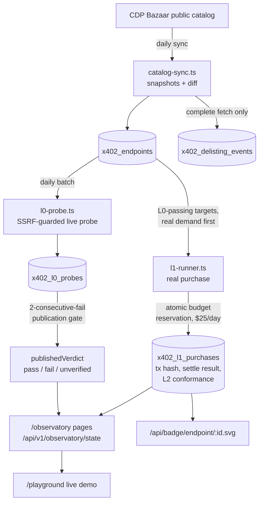
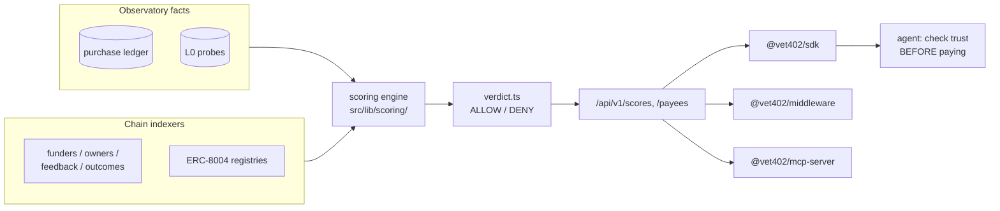

# vet402 Architecture

> 日本語版: [docs/ja/ARCHITECTURE.md](./ja/ARCHITECTURE.md)

vet402 is an independent verification layer for the x402 agent-payment
economy. Its core loop is simple and expensive to fake: **actually use the
endpoints being verified** — probe their payment walls, pay their listed
prices with real funds, and publish every outcome (successes and failures
alike) with evidence.

This document maps the system as it is implemented. When the code and this
document disagree, the code wins — and this document should be fixed.

## 1. Verification levels — facts vs. opinion

The levels are a hard separation, not a marketing tier list:

| Level | Question answered | Money moves? | Where implemented |
|---|---|---|---|
| **L0** | Does the payment wall answer a valid `402` challenge that matches what the catalog declared? | No | `src/lib/observatory/l0-probe.ts` |
| **L1** | Does a real payment at the listed price actually settle? | **Yes** (hard daily budget) | `src/lib/observatory/l1-runner.ts` |
| **L2** | Does the paid response minimally conform to the declared schema? | (piggybacks on L1) | `checkL2` in `l1-runner.ts` |
| **L3** | Quality opinion | No | kept **out** of L0–L2 surfaces entirely |

Two invariants:

- **L0–L2 are facts; L3 is opinion. They never mix.** Observatory pages and
  APIs publish only the closed vocabulary `pass / fail / unverified` with
  definitions, never a composite score or an evaluative word.
- **`unverified` is not a failure.** It means the catalog entry does not
  declare enough for a machine to check (e.g. no method declared → no request
  is ever sent — a GET probe against a POST-declared endpoint would report a
  false death).

## 2. The Observatory data flow

Design decisions that matter:

- **A single fail never publishes.** `publishedVerdict` requires two
  consecutive failing probes — a transient blip must not brand an endpoint
  dead in public (`MIN_CONSECUTIVE_FAILS_TO_PUBLISH = 2`).
- **An incomplete catalog fetch produces no delisting judgements.** A fetch
  gap must never read as "the endpoint vanished".
- **SSRF guard on every outbound probe.** `resourceUrl` is seller-declared
  third-party input; the production fetch refuses targets that are — or
  redirect to — non-public addresses (`src/lib/net/safe-fetch.ts`).
- **Self-exclusion.** The operator's own payTo wallets are excluded from
  purchase candidates, and the Observatory discloses that its operator may
  appear in the catalog it measures.

## 3. Money safety (L1)

Real purchases are the moat and the biggest operational risk, so the budget
gate is structural, not procedural:

- **One SQL statement reserves the spend** (`reserveSpend`): the day's total,
  the per-endpoint sweep-window dedup, and the ledger INSERT are evaluated
  atomically. Two overlapping batches cannot each spend a full daily budget —
  this exact failure was measured before the fix ($49 against a $25 cap) and
  is now regression-tested.
- **Fail-closed activation**: purchases require both the
  `OBSERVATORY_L1_ENABLED` flag and a wallet key; an unreadable ledger reads
  as "budget exhausted", never as "nothing spent today".
- **A challenge over-charging vs. the catalog is recorded, never signed.**
- The `/playground` demo purchase path (`level: "l1"`) goes through the same
  runner narrowed to one endpoint (`onlyEndpointId`), so a demo can never
  spend what the daily batch itself could not.

## 4. Scoring & SpendGuard (separate from the Observatory)

- The score/verdict surface is **keyed** (API keys, quotas); the Observatory
  fact surface is **key-less and public**.
- **SpendGuard is non-custodial and fail-closed**: no clean ALLOW verdict →
  no payment. The SDK distinguishes key-caused refusals (401/403) from
  outage-caused ones (5xx) so callers can fail closed on both, for the right
  reasons.
- The Accuracy Ledger (`src/lib/scoring/accuracy.ts`) publishes vet402's own
  hit/miss record with evidence — the verifier grades itself in public.

## 5. Chains — Base first, adapters per scheme

- **Base (EVM)**: `x402-payer.ts` — the `exact` scheme via EIP-3009 signed
  authorization. The home chain; all figures published to date are Base.
- **Solana**: `sol402-payer.ts` — the `exact` scheme per
  `scheme_exact_svm.md`: a partially-signed versioned transaction
  (ComputeBudget → TransferChecked → Memo) with the facilitator as sponsored
  fee payer. Off by default (`OBSERVATORY_SOLANA_L1_ENABLED` + its own key);
  while off, Solana candidates are excluded in SQL, not "attempted and
  skipped". Base58 payTo case is preserved end-to-end (lowercasing destroys
  base58 — a real ingestion bug found and repaired 2026-08-20).
- **On-chain publication** (`src/lib/chain/registry.ts`, off by default):
  L0–L2 results can be written to the ERC-8004 Validation Registry on Base
  (request → response, `0 | 100`), idempotent via a deterministic request
  hash ledger (`registry_writes`), with a gas circuit breaker. Opinions (L3)
  are never written on-chain.

## 6. Runtime topology

- **Next.js 16 App Router** on Vercel; PostgreSQL on Neon (`vouch` database —
  the name is asserted by `scripts/db-preflight.ts` before any schema push).
- **Crons / background jobs**: daily catalog sync + L0 probe batch, L1
  purchase batch, chain indexers (funders, owners, feedback, outcomes),
  log purge. All emit into the same Postgres.
- **Self-hosting**: `docker compose up` brings up Postgres + the app
  (`Dockerfile`, standalone Next build; see `CONTRIBUTING.md`).
- **Public read surfaces are IP-rate-limited and CDN-cached**; the rate-limit
  store is DB-backed in production and fails closed when unreachable.

## 7. Repository map

| Path | Responsibility |
|---|---|
| `src/app/` | Pages (RFC-paper visual style) + API routes (`src/app/api/v1/`) |
| `src/lib/observatory/` | Catalog sync, L0 probes, L1 purchases (Base+Solana payers), budget, metrics rollup, contributions intake, readers |
| `src/lib/scoring/` | Score engine, sybil, verdict (SpendGuard), accuracy ledger |
| `src/lib/chain/` | viem client, ERC-8004, wallet metrics, indexer windows |
| `src/lib/db/` | Drizzle schema + writers/readers |
| `src/lib/demo/` | `/playground` live-verification core (writes nothing) |
| `packages/` | `@vet402/sdk`, `@vet402/middleware`, `@vet402/mcp-server` |
| `examples/` | `hackathon-starter`, `agentkit-spend-guard`, `x402-trust-gate` |
| `tests/` | `tsx --test`; DB-backed tests gate on `TEST_DATABASE_URL` |
| `docs/` | This file, OpenAPI spec, runbooks, grant materials (`docs/applications/`) |

## 8. Cross-cutting principles

1. **Fail-closed by default** — malformed input is never a reason to spend
   money, publish a verdict, or skip a rate limit.
2. **Measure the instrument, not just the result** — parity tests keep the
   OpenAPI spec, the HTML pages, and the JSON APIs computed from the same
   readers so they cannot disagree.
3. **Facts with denominators** — every public aggregate states what it
   counts and what it excludes.
4. **Demo paths never pollute measurement paths** — `/playground` probes are
   not written into the public register.
