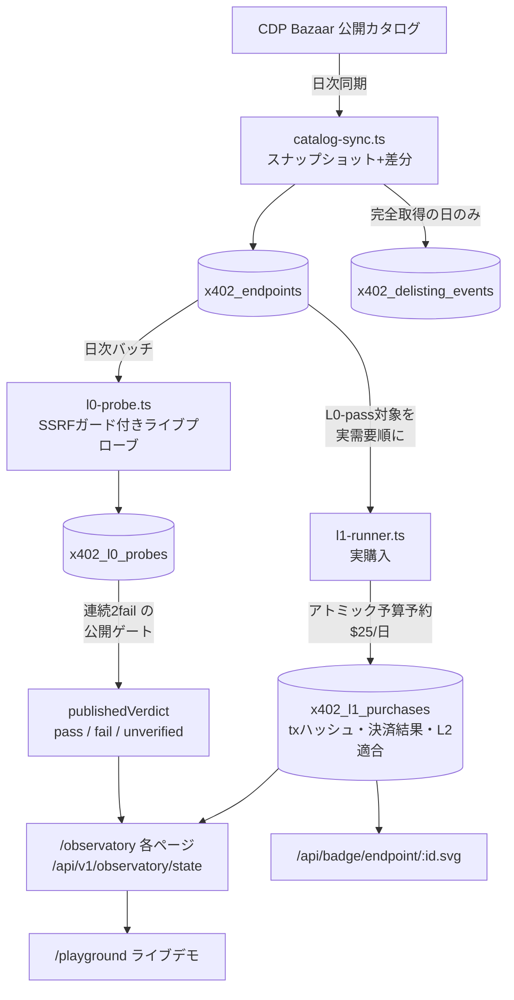

# vet402 アーキテクチャ

> English: [docs/ARCHITECTURE.md](../ARCHITECTURE.md)

vet402 は x402 エージェント決済経済の独立検証レイヤー。中核ループは単純で、
偽装コストが高い——**検証対象のエンドポイントを実際に使う**。支払い壁を
プローブし、掲示価格を実資金で支払い、成功も失敗も同じ重みで証拠付きで
公開する。

この文書は実装されているままの姿を写した地図。コードと食い違ったら
正しいのはコードで、直すべきはこの文書。

## 1. 検証レベル——事実と意見の分離

| レベル | 答える問い | 資金は動くか | 実装 |
|---|---|---|---|
| **L0** | 支払い壁はカタログ申告と整合する有効な `402` チャレンジを返すか | 動かない | `src/lib/observatory/l0-probe.ts` |
| **L1** | 掲示価格での実支払いは本当に決済されるか | **動く**（日次上限あり） | `src/lib/observatory/l1-runner.ts` |
| **L2** | 支払い後のレスポンスは申告スキーマに最低限適合するか | （L1に相乗り） | `l1-runner.ts` 内 `checkL2` |
| **L3** | 品質の意見 | 動かない | L0–L2 の面には**一切**出さない |

不変条件は2つ:

- **L0–L2 は事実・L3 は意見。混ぜない。** 観測所のページとAPIは閉じた語彙
  `pass / fail / unverified` を定義付きで公開するだけ。合成スコアも評価語も
  出さない。
- **`unverified` は失敗ではない。** 機械が検証できるだけの申告がカタログに
  無いという意味（例: メソッド未申告ならリクエスト自体を送らない——
  POST申告のエンドポイントをGETで突けば偽の死亡判定が出るため）。

## 2. 観測所のデータフロー

効いている設計判断:

- **単発failは公開されない。** 一過性の瞬断でエンドポイントを公衆の前で
  死亡認定しないため、連続2回のfailを要求（`MIN_CONSECUTIVE_FAILS_TO_PUBLISH = 2`）。
- **カタログ取得が不完全な日は掲載取消判定を一切出さない。** 取得の穴を
  「消えた」と読んではならない。
- **外向きプローブは全てSSRFガード経由。** `resourceUrl` は売り手申告の
  第三者入力なので、非公開アドレス（へのリダイレクト含む）を拒否する
  （`src/lib/net/safe-fetch.ts`）。
- **自己除外。** 運営者自身の受取ウォレットは購入候補から除外し、運営者が
  自分の測るカタログに載り得ることも開示する。

## 3. 資金の安全（L1）

実購入は堀であると同時に最大の運用リスクなので、予算ゲートは手順ではなく
構造で守る:

- **支出の予約は単一SQL文**（`reserveSpend`）: 当日合計・エンドポイント毎の
  再購入窓・台帳INSERTをアトミックに評価する。バッチが重なっても日次予算を
  二重に使えない——この故障は修理前に実測されており（$25上限に対し$49）、
  回帰テストで固定済み。
- **fail-closedな起動**: 購入には `OBSERVATORY_L1_ENABLED` フラグと
  ウォレット鍵の両方が要る。台帳が読めない時は「今日は未消費」ではなく
  「予算切れ」と読む。
- **カタログより高額を要求するチャレンジは記録され、署名されない。**
- `/playground` のデモ購入（`level:"l1"`）も同じランナーを1エンドポイントに
  絞って通る（`onlyEndpointId`）ので、デモが日次バッチ以上に使えるお金は
  1セントも増えない。

## 4. スコアリングと SpendGuard（観測所とは別系統）

- スコア/判定の面は**キー制**（APIキー・クォータ）。観測所の事実の面は
  **キー無しの公開**。
- **SpendGuard は非カストディアルで fail-closed**: 明確な ALLOW が無ければ
  支払わない。SDKはキー起因の拒否(401/403)と障害起因(5xx)を峻別し、
  どちらでも正しい理由で閉じられるようにしている。
- Accuracy Ledger（`src/lib/scoring/accuracy.ts`）は vet402 自身の的中/外れを
  証拠付きで公開する——検証者が自分を公衆の前で採点する。

## 5. チェーン——Baseが主・schemeごとのアダプタ

- **Base (EVM)**: `x402-payer.ts`——EIP-3009 署名の `exact` scheme。ホーム
  チェーンで、公開済みの数字は全て Base。
- **Solana**: `sol402-payer.ts`——`scheme_exact_svm.md` 準拠の部分署名
  versioned tx（ComputeBudget → TransferChecked → Memo・feePayer は
  ファシリテータのスポンサー）。既定OFF（専用フラグ＋専用鍵）。OFFの間は
  SQL段階で候補から除外する。base58 の payTo は端から端まで大文字小文字を
  保存する（小文字化は base58 を破壊する——2026-08-20 に実在の取込バグを
  発見・修復済み）。
- **オンチェーン公開**（`src/lib/chain/registry.ts`・既定OFF）: L0–L2 の
  結果を Base の ERC-8004 Validation Registry へ書ける（request→response・
  0|100）。決定的 hash の台帳（registry_writes）で冪等・ガス上限ブレーカ
  付き。意見（L3）はオンチェーンにも書かない。

## 6. 実行環境

- **Next.js 16 App Router**（Vercel）+ **PostgreSQL**（Neon・database名は
  `vouch`。`scripts/db-preflight.ts` がスキーマ適用前に名前をassertする）。
- **cron/バックグラウンド**: カタログ同期+L0バッチ（日次）・L1購入バッチ・
  チェーンインデクサ（funders/owners/feedback/outcomes）・ログ削除。
- **セルフホスト**: `docker compose up` で Postgres+アプリが立つ
  （`Dockerfile`・standalone出力。手順は `CONTRIBUTING.md`）。
- **公開読み取り面はIPレート制限+CDNキャッシュ**。レート制限ストアは
  本番でDBバック・到達不能時はfail-closed。

## 7. リポジトリ地図

| パス | 責務 |
|---|---|
| `src/app/` | ページ（RFC紙面様式）+ APIルート（`src/app/api/v1/`） |
| `src/lib/observatory/` | カタログ同期・L0プローブ・L1購入・予算・リーダー |
| `src/lib/scoring/` | スコアエンジン・sybil・verdict（SpendGuard）・Accuracy Ledger |
| `src/lib/chain/` | viem・ERC-8004・ウォレット指標・インデクサ窓 |
| `src/lib/db/` | Drizzleスキーマ + reader/writer |
| `src/lib/demo/` | `/playground` のライブ検証コア（何も書き込まない） |
| `packages/` | `@vet402/sdk` / `middleware` / `mcp-server` |
| `examples/` | `hackathon-starter` / `agentkit-spend-guard` / `x402-trust-gate` |
| `tests/` | `tsx --test`。DB系は `TEST_DATABASE_URL` でゲート |
| `docs/` | 本書・OpenAPI・ランブック・申請素材（`docs/applications/`） |

## 8. 横断原則

1. **既定でfail-closed**——不正な入力は、金を使う・判定を公開する・レート
   制限を飛ばす理由には決してならない。
2. **結果だけでなく測定器を検証する**——OpenAPI・HTML・JSON APIは同じ
   リーダーから計算され、パリティテストで食い違いを禁止している。
3. **分母付きの事実**——公開する集計は必ず「何を数え、何を除いたか」を
   明記する。
4. **デモ経路は測定経路を汚さない**——`/playground` のプローブは公開台帳に
   書かれない。
